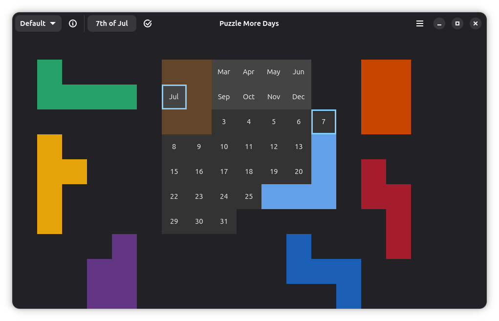

# Puzzle More Days

A Libadwaita application to solve daily puzzles in various formats. It can tell you, if you are on the
right track or, whether it is impossible to solve the puzzle with your current approach.



## Build and Run

### Gnome Builder (recommended)

When you clone and open the project in Gnome Builder, it will automatically tell you to download the required
dependencies. After that, you can build and run the project from within Gnome Builder.

### Build Manually

You need the following dependencies to build the project:

- Rust and Cargo
- Meson
- GTK4 and Libadwaita dependencies

Then you can install it from the command line (more dependencies may be required):

```bash
meson setup build
meson compile -C build
meson install -C build
```

## License

This project is licensed under the GNU General Public License v3.0. See the COPYING file for details.
